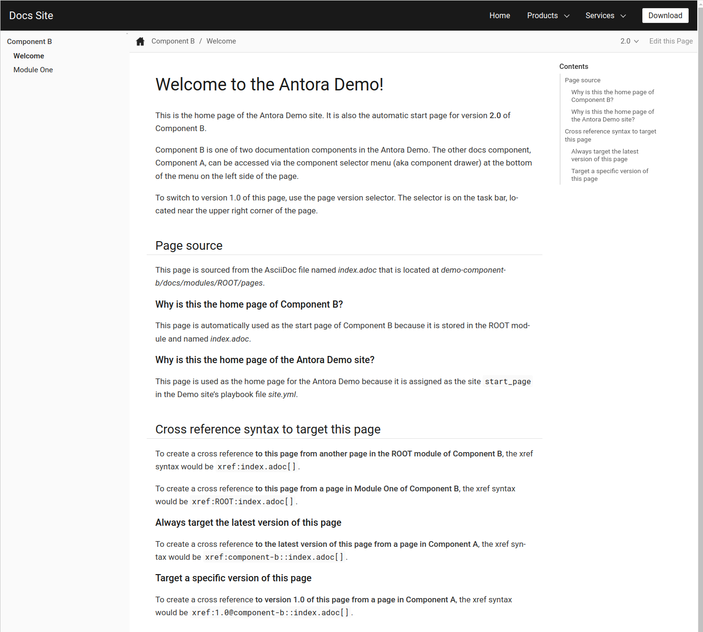

:source-highlighter: highlight.js

# 自作ホームページ開発メモ

## Install WSL
Antoraを取り扱うのに都合がいいので、WSLをインストールします。
* 参考:: https://qiita.com/SBS_Takumi/items/f5f8a5934e00c7a7efb8

[source,sh]
----
$ wsl --install
----

## VScodeのフォント変更
Windowsのフォントは汚いので、以下を参考にして、フォントを変更します。

参考ページ:: https://qiita.com/haya_ken/items/d9f32bcbb6cd0e6199ed

Font Family に 'Source Han Code JP' とクオーテーション付きで指定するとうまくいきました。

## Install Chrome (WSL)
自作サイトのプレビュー用に、WSLにchromeをインストールします。以下の手順に従って進めてください。

[source,sh]
----
$ sudo apt update && sudo apt -y upgrade && sudo apt -y autoremove
$ cd /path/to/workdir/
$ mkdir chrome && cd chrome
$ wget https://dl.google.com/linux/direct/google-chrome-stable_current_amd64.deb
$ sudo apt -y install ./google-chrome-stable_current_amd64.deb
----

以下のコマンドを打って、chromeのバージョンが表示されたら成功です。

[source,sh]
----
google-chrome --version
----

参考:: https://scottspence.com/posts/use-chrome-in-ubuntu-wsl

## Antora
以下、このページを参考に進めていきます。

参考ページ:: https://docs.antora.org/antora/latest/install-and-run-quickstart/

### Install Node.js

以下のコマンドを打ってみます。バージョンが表示されたら、Node.jsはインストール済み。そうでなければ未インストールです。

[source,sh]
----
$ node -v
----

私の環境ではバージョンが表示されなかったので、インストールしていきます。 +
nvmと呼ばれるバージョン管理ソフトがあるようなので、それをインストールします。 +

参考ページ:: https://github.com/nvm-sh/nvm#installation-and-update

.Install NVM
[source,sh]
----
$ curl -o- https://raw.githubusercontent.com/nvm-sh/nvm/v0.40.1/install.sh | bash

$ export NVM_DIR="$([ -z "${XDG_CONFIG_HOME-}" ] && printf %s "${HOME}/.nvm" || printf %s "${XDG_CONFIG_HOME}/nvm")"
[ -s "$NVM_DIR/nvm.sh" ] && \. "$NVM_DIR/nvm.sh"
----

.Install Node.js
[source,sh]
----
$ nvm install --lts
$ node -v # Version 確認
v22.11.0
$ nvm alias default 16 # これはエラーになって実行できず。古いバージョン 16 がない。
$ nvm alias default v22.11.0 # 代わりにこのコマンドを打つ。これは、環境変数の設定に必要。このコマンドを打たないと例えば新しいターミナルを立ち上げたときに、npxコマンドやnodeコマンド、npmコマンドなどが使用できなくなる。
----

### Install Antora

.Install command
[source,sh]
----
$ mkdir docs-site && cd docs-site
$ node -e "fs.writeFileSync('package.json', '{}')"
$ npm i -D -E antora # ここで Warning が出た。
----

.Warning
[source,sh]
----
npm warn deprecated inflight@1.0.6: This module is not supported, and leaks memory. Do not use it. Check out lru-cache if you want a good and tested way to coalesce async requests by a key value, which is much more comprehensive and powerful.
npm warn deprecated glob@7.1.3: Glob versions prior to v9 are no longer supported
----

`Node.js` のバージョンが新しすぎて、 `Antora` が使用している関数が廃止されているらしい。いったん無視して進める。

### Antora Test

自作サイトを作るためには、Antoraの設定ファイル（playbook）を作成する必要があるらしいです。先ほど作った `docs-site` ディレクトリに `antora-playbook.yml` を作成します。

.antora-playbook.yml
[source,yml]
----
site:
  title: Docs Site
  start_page: component-b::index.adoc # ここにホームページのasciidocを指定します。
content:
  sources: 
  - url: https://gitlab.com/antora/demo/demo-component-a.git
    branches: HEAD
  - url: https://gitlab.com/antora/demo/demo-component-b.git
    branches: [v2.0, v1.0]
    start_path: docs
ui: 
  bundle:
    url: https://gitlab.com/antora/antora-ui-default/-/jobs/artifacts/HEAD/raw/build/ui-bundle.zip?job=bundle-stable
    snapshot: true
----

以下のコマンドで、サイトを生成します。

.Antoraの立ち上げ
[source,sh]
----
$ npx antora antora-playbook.yml
----

実行結果として、コンソール上にURLが生成されます。

.生成結果（コンソール出力）
[source,sh]
----
Site generation complete!
Open file:///home/XXXXXXXXX/HOME/docs-site/build/site/index.html in a browser to view your site.
----

このURLを、chromeに入力すれば、作成したサイトをプレビューできます。chromeは以下のコマンドで起動します。起動できない場合は、 <<Install Chrome (WSL)>> を参考に、chrome をインストールしてください。
----
$ google-chrome
----

以下のような画面が表示されれば成功です。

